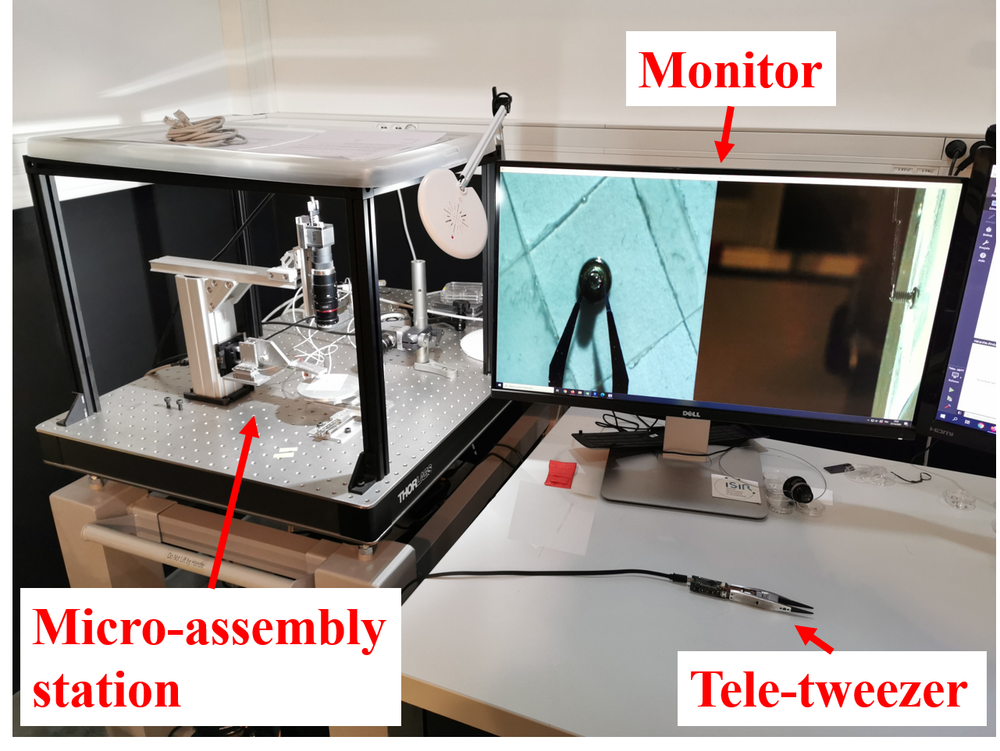
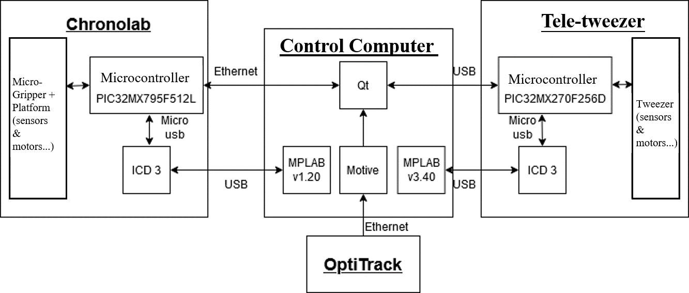
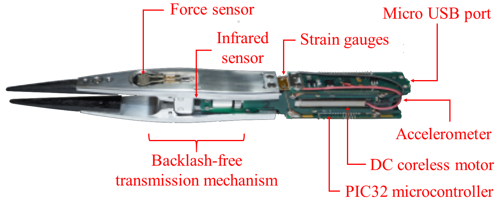
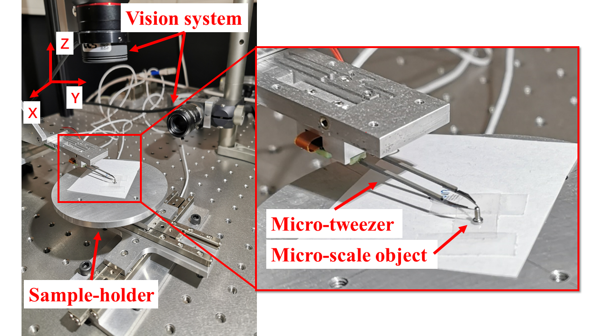
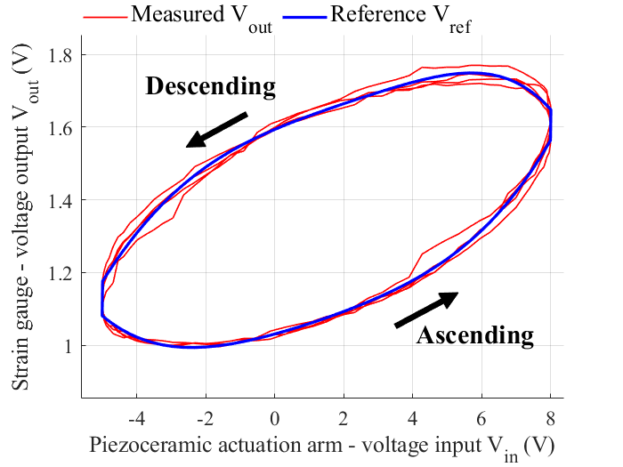
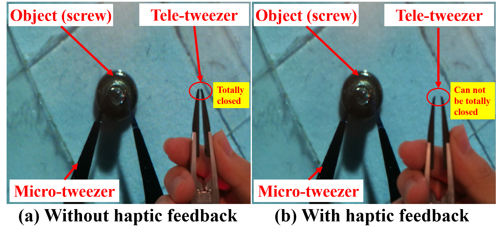

# Teleoperated Micro-Assembly System with Haptic Feedback


This project presents the design and implementation of a **human–machine interface (HMI) for teleoperated micro-assembly with haptic feedback**.

The system enables an operator to manipulate **sub-millimeter components remotely** using a portable **tele-tweezer master device**, which controls a robotic **micro-gripper slave system**.

The work was conducted from March 2020 to November 2020 at the **Institute for Intelligent Systems and Robotics (ISIR), Sorbonne University**, within the framework of the **COLAMIR project**.

Overview of the hardware platform: 



---

# Project Highlights

• Development of a **master–slave teleoperation system for micro-assembly**  
• Implementation of **high-speed UDP communication (220 Hz control loop)**  
• **Hysteresis modeling of piezoelectric micro-grippers** for force compensation  
• **Bilateral haptic coupling** enabling force feedback to the operator  

---

# Overview

Micro-assembly tasks involve manipulation of objects at **sub-millimeter scale**, such as components used in watchmaking, electronics, and biomedical devices.

These tasks are traditionally performed manually using **precision tweezers under microscopes**, requiring high dexterity and expertise.

This project proposes a **cobotic teleoperation system** combining:

- human expertise and dexterity
- robotic precision
- real-time haptic feedback

The goal is to **assist operators in precision manipulation while preserving human decision-making in the loop**.

---

# System Architecture

The teleoperation platform consists of four main subsystems:

- **Tele-tweezer** (master device)
- **ChronoLab micro-manipulation station** (slave device including micro-gripper, sensors and cameras)
- **Control computer**
- **OptiTrack motion tracking system**

The operator manipulates the tele-tweezer, which controls the robotic micro-gripper in real time.

Illustration of system architecture:


---

# Hardware Platform

## Master Device – Tele-Tweezer

A portable device designed to replicate the shape and functionality of traditional precision tweezers.

Features:

- strain gauges for deformation measurement
- force sensing
- DC motor for haptic feedback
- accelerometer
- embedded PIC32 microcontroller

The tele-tweezer allows intuitive control of the remote micro-gripper.



---

## Slave Device – Robotic Micro-Gripper

The slave interface is a robotic micro-assembly station used to manipulate micro-components.

Features:

- piezoelectric micro-gripper
- strain gauges for force sensing
- precision positioning platform
- optical observation system



---

# Research Contributions

## High-Speed Communication Architecture

The original system used **TCP communication**, limiting control frequency to about **40 Hz**.

To improve teleoperation responsiveness, a **UDP communication server** was implemented directly on the embedded controller.

Results:

- communication frequency increased to **≈220 Hz**
- command latency reduced to **7–9 ms**
- embedded control loop **≈2.6 ms**

---

## Master–Slave Motion Coupling

A real-time mapping was implemented between:

```
tele-tweezer opening/closing → actuation of micro-gripper (opening/closing) 
```

This enables intuitive remote manipulation of micro-scale objects through the following steps:

```
Operator
   ↓
Tele-tweezer (Master Interface)
   ↓
UDP Communication
   ↓
Control Computer
   ↓
Robotic Micro-Gripper (Slave)
```

---

## Hysteresis Modeling of Piezoelectric Actuators

The micro-gripper uses **piezoelectric actuators**, which exhibit nonlinear hysteresis.

Experiments were conducted to:

- measure actuator response
- identify hysteresis behavior
- derive a polynomial hysteresis model

The model enables **force correction and improved gripping accuracy**.

---

## Bilateral Teleoperation with Haptic Feedback

A **bilateral coupling scheme** was implemented.

When the micro-gripper contacts an object:

1. strain gauges measure interaction forces  
2. force information is transmitted to the master device  
3. a motor generates **haptic feedback on the tele-tweezer**

The operator can therefore **feel contact events remotely**, preventing excessive gripping forces.

---

# Experimental Demonstration

Micro-assembly tasks were performed to validate the system.

### Hysteresis identification



### With and without haptic feedback



### Demonstration video

For the full experimental demonstration video, click the following link: https://youtu.be/xx

---

# Technologies Used

## Programming

- C
- C++

## Communication

- UDP socket communication
- TCP/IP networking

## Embedded Systems

- PIC32 microcontrollers
- MPLAB X IDE
- Microchip ICD3 debugger

## Software

- Qt Creator
- MATLAB (system identification and data analysis)

## Sensors and Hardware

- strain gauges
- force sensors
- piezoelectric actuators
- optical vision system
- OptiTrack motion tracking

---

# Applications

Potential applications include:

- watchmaking micro-assembly
- micro-electronics assembly
- biomedical micro-manipulation
- teleoperated precision robotics

---

# Project Context

This research was conducted at:

**Institute for Intelligent Systems and Robotics (ISIR)**  
Sorbonne University  
Paris, France

within the project:

**COLAMIR – Agile Micro-Collaborative Robots for Ultra-Precision Assembly**

Funded by:

- French National Research Agency (ANR)
- Percipio Robotics

---

# Author

Zibo Zhang  
PhD in Robotics  
IMT Atlantique / Université Grenoble Alpes
